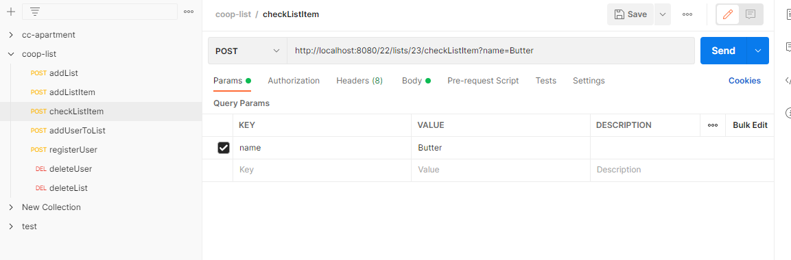
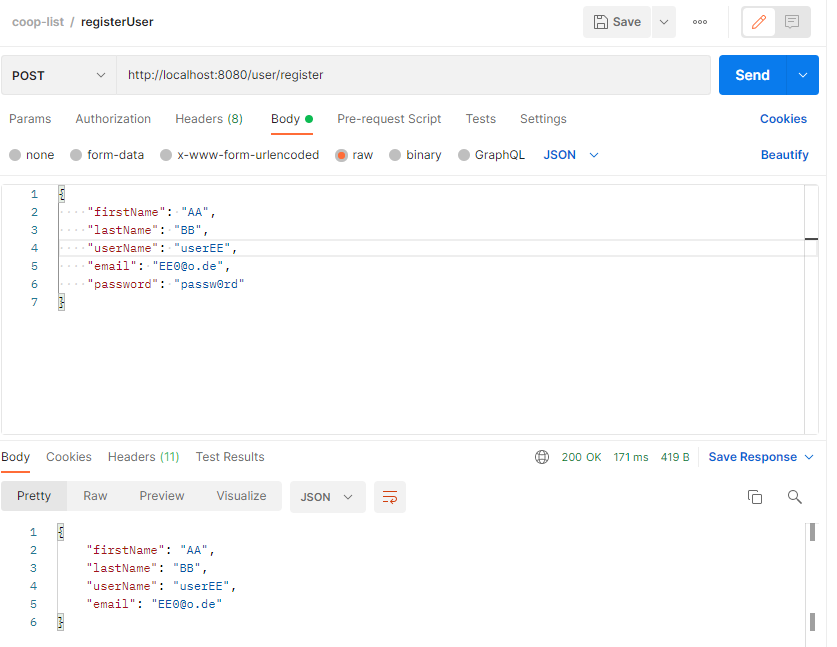
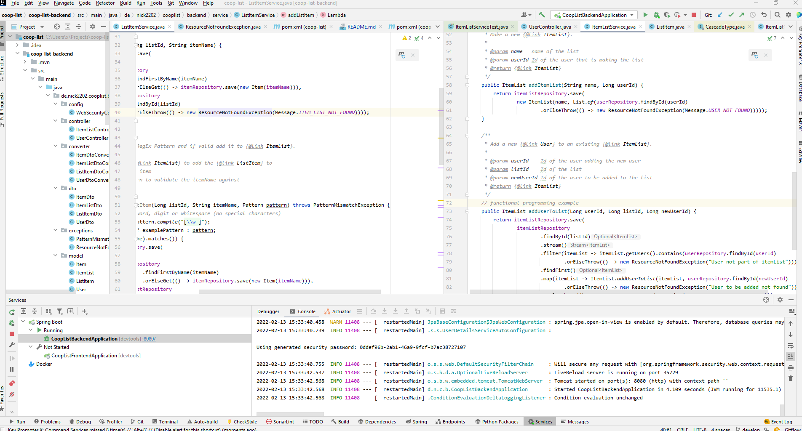
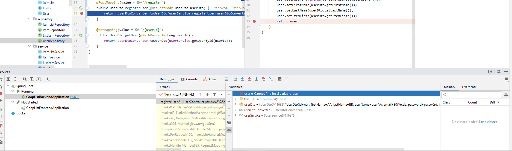

## 1. Git

- used branches
- used merges
- tried out Gitflow

## 5. Clean Code

[Cheat Sheet (Java)](resources/CleanCodeCheatSheet_JavaSpringBoot.pdf)

1. see project structure
2. see any Class
3. e.g. by using streams (see
   e.g. [addUserToList](coop-list-backend/src/main/java/de/nick2202/cooplist/backend/service/ItemListService.java))
4. see entity classes or services
5. see
   this [Enum](coop-list-backend/src/main/java/de/nick2202/cooplist/backend/exceptions/ResourceNotFoundException.java)
6. e.g. using SpringBoot
7. see services (
   e.g. [ItemListService](coop-list-backend/src/main/java/de/nick2202/cooplist/backend/service/ItemListService.java))
8. see tests

## 6. Build Management

### Maven:

- multi-module
- calls tests automatically
- generated [API docs](coop-list-backend/src/main/resources/api-docs.yaml) with springdoc-openapi-ui as YAML (Maven
  dependency)

## 7. Tests

### Unit Tests:

- [ItemListServiceTest](coop-list-backend/src/test/java/de/nick2202/cooplist/backend/service/ItemListServiceTest.java)
- [ListItemServiceTest](coop-list-backend/src/test/java/de/nick2202/cooplist/backend/service/ListItemServiceTest.java)
- [UserServiceTest](coop-list-backend/src/test/java/de/nick2202/cooplist/backend/service/UserServiceTest.java)

### Integration Tests:

- [ListItemRepositoryTest](coop-list-backend/src/test/java/de/nick2202/cooplist/backend/repository/ListItemRepositoryTest.java)
- Endpoint Tests - Overview (manual via Postman)
  
- Endpoint Test - RegisterUser (POST) (manual via Postman)
  

## 9. IDE

### Intellij:

- Setup
  
- Debugging
  

**Favorite shortcuts (using old Eclipse keymap):**

- Ctrl+Space - Autocomplete (of course)
- Ctrl+Shift+Space - QuickDoc
- Alt+Shift+R - Refactor
- Ctrl+Shift+F - Auto-Format
- Ctrl+Shift+N - Generate Getter/Setter, Constructor etc. (custom)

## 10. DSL

- [example 1](coop-list-backend/src/main/java/de/nick2202/cooplist/backend/converter/UserDtoConverter.java) (Builder
  Pattern)
- [example 2](coop-list-backend/src/main/java/de/nick2202/cooplist/backend/service/ListItemService.java) (RegEx)
- [example 3](coop-list-backend/src/main/java/de/nick2202/cooplist/backend/repository/ListItemRepository.java) (SQL)

## 11. Functional Programming

**(mostly) side effect free functions & the use of higher-order functions & functions as parameters and return values &
use closures / anonymous functions:**

- [example 1](coop-list-backend/src/main/java/de/nick2202/cooplist/backend/service/ItemListService.java)
- [example 2](coop-list-backend/src/main/java/de/nick2202/cooplist/backend/service/ListItemService.java)

(annotated with // functional programming example)

**only final data structures:**

- [example 3](coop-list-backend/src/main/java/de/nick2202/cooplist/backend/service/ItemListService.java) (e.g.
  constructor parameters)

 
missing:

- user authentication
- frontend